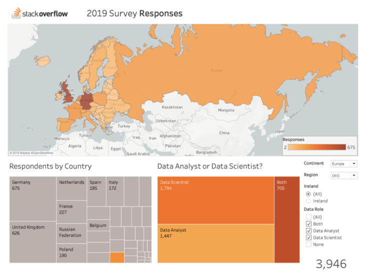
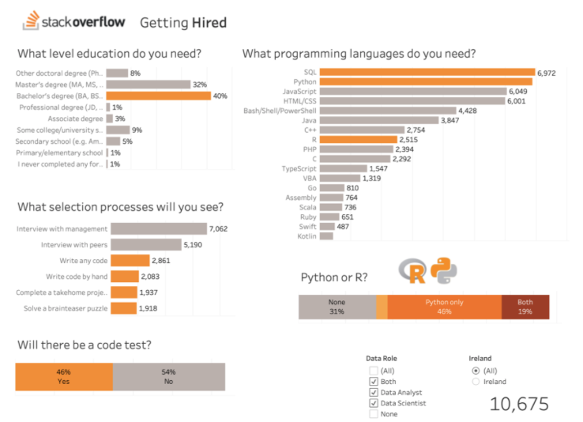
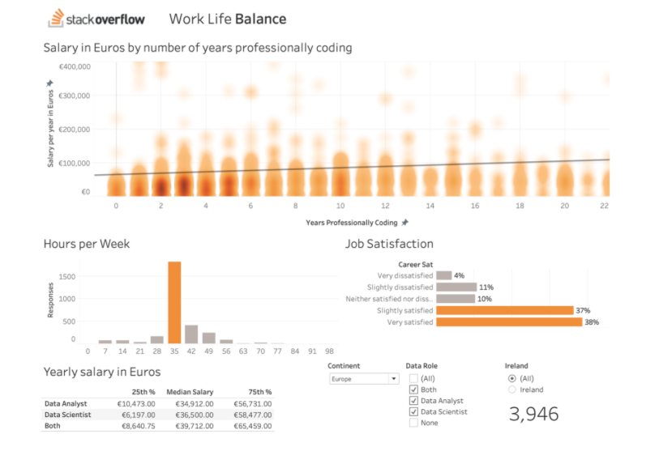
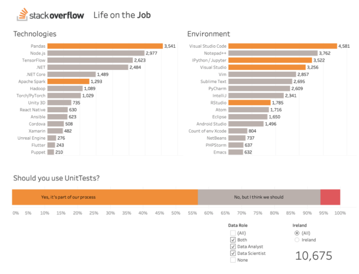

# Tableau presentaiton of the stack overflow devleoper survey.

Continuous assessment for module B8IT107 Data Visualization & Communications taught by David Gordon as part of the Dublin Business School Higher Diploma in Data Analytics.

Each student selected their own data set, prepared a presentation in [apple keynote](https://github.com/barrysheppard/Tableau_StackOverflow_Dev_Survey/blob/master/presentation.key) and [tableau](https://github.com/barrysheppard/Tableau_StackOverflow_Dev_Survey/blob/master/stack_overflow_2019.twb), and gave a spoken presentation.

I selected the data set from the 2019 Stack Overflow developer survey to see how the course so far has prepared students for future data roles.

